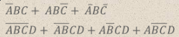

# CSC 1202 - Computer Organization Notes

Lecturer: Dr Adelina Tang Lai Toh

[Back to Home](index.md)

## Contents

- [CSC 1202 - Computer Organization Notes](#csc-1202---computer-organization-notes)
    - [Contents](#contents)
    - [CSC1202 Lecture Slides Answers](#csc1202-lecture-slides-answers)
        - [Computer Evolution and Performance Issues](#computer-evolution-and-performance-issues)
            - [Chapter 1 - Basic Concepts & Computer Evaluation](#chapter-1---basic-concepts-computer-evaluation)
            - [Chapter 2 - Performance Issues](#chapter-2---performance-issues)
        - [Number Systems and Computer Arithmetic](#number-systems-and-computer-arithmetic)
            - [Chapter 9 - Number Systems](#chapter-9---number-systems)
            - [Chapter 10 - Computer Arithmetic](#chapter-10---computer-arithmetic)
        - [Digital Logic](#digital-logic)
            - [Chapter 11 - Digital Logic](#chapter-11---digital-logic)
        - [Instruction sets: Characteristics and Functions, Addressing Modes and Formats](#instruction-sets--characteristics-and-functions--addressing-modes-and-formats)
            - [Chapter 12 - Instruction Sets: Characteristics and Functions](#chapter-12---instruction-sets--characteristics-and-functions)
            - [Chapter 13 - Instruction Sets: Addressing Modes and Formats](#chapter-13---instruction-sets--addressing-modes-and-formats)
        - [Computer Functions and Interconnections, Cache, Internal and External Memory, Input/Output](#computer-functions-and-interconnections--cache--internal-and-external-memory--input-output)
            - [Chapter 3 - A Top-Level View of Computer Function and Interconnection](#chapter-3---a-top-level-view-of-computer-function-and-interconnection)
            - [Chapter 4 - Cache Memory](#chapter-4---cache-memory)
            - [Chapter 5 - Internal Memory](#chapter-5---internal-memory)
            - [Chapter 6 - External Memory](#chapter-6---external-memory)
            - [Chapter 7 - Input/Output](#chapter-7---input-output)
        - [Processor Structure and Function, Control Unit Operation, Microprogramming Control](#processor-structure-and-function--control-unit-operation--microprogramming-control)
            - [Chapter 14 - Processor Structure and Function](#chapter-14---processor-structure-and-function)
            - [Chapter 20 - Control Unit Operation](#chapter-20---control-unit-operation)
            - [Chapter 21 - Microprogrammed Control](#chapter-21---microprogrammed-control)
        - [RISC, Parallelism, Superscalar Concepts, Multicore Computer, GPUs and Industry Trends](#risc--parallelism--superscalar-concepts--multicore-computer--gpus-and-industry-trends)
            - [Chapter 15](#chapter-15)
            - [Chapter 16 - 19](#chapter-16---19)
    - [8085 Assembly](#8085-assembly)
        - [8085 Characteristics to Note](#8085-characteristics-to-note)
        - [8085 Op Codes](#8085-op-codes)
        - [8085 Status Registers/Flags](#8085-status-registers-flags)
    - [CSC 1201 Exam Coverage](#csc-1201-exam-coverage)

---

## CSC1202 Lecture Slides Answers

### Computer Evolution and Performance Issues

#### Chapter 1 - Basic Concepts & Computer Evaluation

1. **Distinguish between structure and function:**
  - Structure: The way in which components relate to each other.
  - Function: The operation of individual components as part of the structure.

1. **Name Two Assembly Language applications:**
  - Direct hardware manipulation, accessing specialized processor instructions, address critical performance issues.

#### Chapter 2 - Performance Issues

1. **Processing speed is an important feature of computer's performance. What else is considered important when buying a computer?**
  - Storage, RAM size, etc.

[Back to contents](#contents)

---

### Number Systems and Computer Arithmetic

#### Chapter 9 - Number Systems

1. **Find the ASCII hexadecimal code for the character "a"**
    - 61

1. **Find the ASCII decimal code for the character " " (space)**
    - 32

1. **Decipher this person's identity by converting the ASCII hexadecimal codes into their equivalent characters. `45 2E 20 53 61 6C 74`**
    - E. Salt

#### Chapter 10 - Computer Arithmetic

1. **Explain the term "overflow".**
    - If two numbers with the same sign (both positive or negative) are added, then overflow occurs if and only if the result has the opposite sign.

2. **Discuss the responsibilities of the ALU.**
    - Performs arithmetic and logical operations on data.
    - Everything else in the computer is there to service this unit.
    - Handles integers, performs simple Boolean logic operations

3. **What steps would you take to obtain the twos complement representation of a negative number?**
    - Take the positive equivalent's binary form and invert all bits, then add 1. Eg, 55 in binary would be `0011 0111`, so twos complement representation of -55 would be `1100 1000` then added `1` to become `1100 1001`

4. **How would you represent -23 in twos complement form?**
    - 23 would be `0001 0111`, so -23 would be `11101001`

5. **Why is normalization necessary? Give an example of a normalized number.**
    - Normalization is necessary to simplify operations on floating-point numbers. An example of a normalized number would be 1234 becoming 1.234x10

[Back to contents](#contents)

---

### Digital Logic

#### Chapter 11 - Digital Logic

1. **Draw a Karnaugh map to simplify in Sum of Products (SOP) and Product of Sums (PSO) forms, if they exist.**

    

2. **Design the corresponding combinational circuits of the simplified forms in the previous question.**

3. **Differentiate between combinational and sequential circuits.**

    | Combinational Logic Circuits                                                                   | Sequential Logic Circuits                                                                             |
    | ---------------------------------------------------------------------------------------------- | ----------------------------------------------------------------------------------------------------- |
    | Output is a function of the present inputs (Time Independent Logic)                            | Output is a function of clock, present inputs and the previous states of the system.                  |
    | Do not have the ability to store data (state)                                                  | Have memory to store the present states that is sent as contro input (enable) for the next operation. |
    | It does not require any feedback. It simply outputs the input according to the logic designed. | It involves feedback from output to input that is stored in the memory for the next operation.        |
    | Used mainly for Arithmetic and Boolean operations                                              | Used for storing data                                                                                 |
    | Logic gates are elementary building blocks.                                                    | Flip flops (binary storage device) are the elementary building unit                                   |
    | Independent of clock and hence does not require triggering to operate.                         | Clocked (triggered for operation with electronic pulses)                                              |
    | Eg: Adder (1 + 0 = 1); Dependency only on present inputs ie. 1 and 0                           | Eg. Counter (Previous OP + 1 = Current OP); Depedency on present input as well as previous input.     |

4. **What type of circuit has _"two outputs which are complements of each other"_?**

[Back to contents](#contents)

---

### Instruction sets: Characteristics and Functions, Addressing Modes and Formats

#### Chapter 12 - Instruction Sets: Characteristics and Functions

1. **Is it possible to write an instruction using only one address? How would you do this?**

2. **Explain the little-endianbyte ordering scheme.**

    Big Endian - most significant byte in smallest address

    | Address | Value |
    | ------- | ----- |
    | 1000    | 90    |
    | 1001    | AB    |
    | 1002    | 12    |
    | 1003    | CD    |

    Little Endian - least significant byte in smallest address

    | Address | Value |
    | ------- | ----- |
    | 1000    | CD    |
    | 1001    | 12    |
    | 1002    | AB    |
    | 1003    | 90    |

    Basically, difference is like right-to-left langauges vs left-to-right languages. Only difference in representation of data.

3. **Differentiate between the "shift" and "rotate" operations.**

#### Chapter 13 - Instruction Sets: Addressing Modes and Formats

1. **Give an example of an instruction used in direct addressing.**
    - `ADD B` - Add contents of register B to accumulator.
    - `ADD a` - Look in memory at address `a` for operand.

2. **How is register addressing different from register indirect addressing?**
    - Register addressing refers to a register space, indirect addressing refers to a pointer in memory that points to an operand.

3. **How is indirect addressing similar to register indirect addressing?**
    - Indirect addressing and register indirect addressing both refers to a pointer to operand, only difference is the pointer in indirect addressing is stored in memory while the pointer in register indirect addressing is stored in the register.

4. **Identify the addressing modes of the following instructions:**
    - `MVI D,00`
    - `LDA C020`
    - `MOV C,M`
    - `INX H`
    - `MOV B,C`

5. **There are 5 types of addressing modes: (Parentheses are to be interpreted as _contents of_)**

    | Addresing Mode    | Algorithm         | Main Advantage      | Main Disadvantage          |
    | ----------------- | ----------------- | ------------------- | -------------------------- |
    | Immediate         | Operand = A       | No memory reference | Limited operand magnitude  |
    | Direct            | EA = A            | Simple              | Limited address space      |
    | Indirect          | EA = (A)          | Large address space | Multiple memory references |
    | Register          | EA = R            | No memory reference | Limited address space      |
    | Register Indirect | EA = (R)          | Large address space | Extra memory reference     |
    | Stack             | EA = top of stack | No memory reference | Limited applicability      |

    **Examples of addressing modes**

    | Addresing Mode    | Explanation                                                                             | Example                                                                                                                  |
    | ----------------- | --------------------------------------------------------------------------------------- | ------------------------------------------------------------------------------------------------------------------------ |
    | Immediate         | Operand is part of instruction                                                          | `ADD 5` - Add 5 to accumulator                                                                                           |
    | Direct            | Address field contains address of operand                                               | `ADD (a)` - Add contents of memory location `(a)` to accumulator                                                         |
    | Indirect          | Memory cell pointed to by address field contains the address of (pointer to) the oprand | `ADD (a)` - add contents of the memory location pointed to by `(a)` to accumulator (`(a)` is a pointer in a memory cell) |
    | Register          | Operand is held in register named in address filed                                      | `MOV A, B` - move contents of register `B` to register `A`                                                               |
    | Register Indirect | Operand is in memory location pointed to (pointer) by contents of register R            | `ADD (a)` - add contents of the memory location pointed to by `(a)` to accumulator (`(a)` is a pointer in register)      |
    | Stack             | Operand is (implicitly) on top of stack                                                 | `PUSH B` - copy values from register B onto stack                                                                        |

[Back to contents](#contents)

---

### Computer Functions and Interconnections, Cache, Internal and External Memory, Input/Output

#### Chapter 3 - A Top-Level View of Computer Function and Interconnection

1. **Describe the term 'software'.**
    - A sequence of codes and instructions, part of the hardware inteprets each instruction and generates control signals, provide a new sequence of codes for each new program instead of rewiring the hardware.

2. **What is an interrupt and when would you use it?**
    - A pause/stop in program execution. Used when an illegal access is attempted, to allow IS to perform certain function, to signal the end of execution, to signal errors. (hardware and software errors)

3. **A key characteristic of a bus in that it is a shared transmission medium. Why is this considered useful?**
    - Provides a pathway between components. Multiple buses allow different components at various levels of the computer system hierachy to communicate at the same time.

#### Chapter 4 - Cache Memory

1. **What is cache memory?**
    - A small type of volatile memory that provides high-speed access to a processor. It is the fastest memory in a computer, and is typically integrated into the processor.

2. **Why is cache memory considered an essential part of a typical computer memory design?**
    - Cache provides faster data access by storing instances of program and data routinely accessed by the processor. Other types of memory are too slwo to keep up with the processor.

#### Chapter 5 - Internal Memory

1. **What are the differences between SRAM and DRAM in terms of speed and cost?**

    | SRAM                  | Both     | DRAM                     |
    | --------------------- | -------- | ------------------------ |
    | low capacity          | volatile | higher capacity          |
    | used for CPU cache    |          | used for computer RAM    |
    | expensive ($5000/GB)  |          | cheaper ($50/GB)         |
    | low power consumption |          | higher power consumption |

    [In-depth explanation here](https://www.diffen.com/difference/Dynamic_random-access_memory_vs_Static_random-access_memory)

2. **What is ROM? Give to applications of ROM.**
    - ROM : contains permanent data that cannot be changed/added to
    - used for : BIOS, game cartridges, firmware

3. **Describe flash memory. Identify one popular way that flash memory is used.**
    - Uses electrical erasing technologies, does not provide byte-level erasure. Microchip is organized so that a section of memory cells are erased in a flash.
    - Used as RAM, SSD, thumb drives.

#### Chapter 6 - External Memory

1. **What is a Solid State Drive (SSD)? Identify a common type of SSD.**
    - A memory device made with solid state components that can be used as a HDD replacement. A common type of SSD: NAND flash.

#### Chapter 7 - Input/Output

1. **Describe the weaknesses of programmed and interrupt-driven I/O. What has the industry proposed to overcome these weaknesses?**
    - Weaknesses:
      - I/O rate limited by the speed with which the processor can test & service a device.
      - Processor is tied up in managing an I/O transfer; a number of intructions must be executed for each I/O transfer.
    - Proposed:
      - A more efficient technique: Direct Memory Access (DMA)

[Back to contents](#contents)

---

### Processor Structure and Function, Control Unit Operation, Microprogramming Control

#### Chapter 14 - Processor Structure and Function

1. **What are general purpose registers used for?**
    - Enables the machine or assembly language programmer to minimize main memory references by optimising use of registers (slide 9)

2. **What are condition codes? Discuss one advantage of using such codes.**
    - Also referred as flags, they are bits set by the processor hardware as the result of the operations (slide 10) e.g the condition codes can be saved on the stack during subroutine calls along with other register info (slide 11)

3. **Explain the role of the Sign bit in the Program Status Word (PSW)**
    - Sign of the last arithmetic operation, "1" indicates a negative result, "0" otherwise.

4. **What is the advantage of instruction pipelining? What is key to pipeline efficiency?**
    - Achieves parallelism wihtout replication, improves processor performance (slide 23). Keeping the pipeline full (slide23)

#### Chapter 20 - Control Unit Operation

1. **Describe the role of the control unit in the CPU.**
    - It generates the control signals for the micro-operations to be executed (slide 38)

2. **What is a micro-operation?**
    - It is the most basic and fundamental operation that involves registers (slide 39)

3. **Discuss the sequencing function of the control unit.**
    - Causes the CPU to step through a series of micro-operations in the proper sequence/order, based on the program (slide 44)

4. **Name a typical method to implement the control unit.**
    - Hardwired/microprogrammed (slide 46)

#### Chapter 21 - Microprogrammed Control

1. **What is a microprogram?**
    - A sequence of microinstructions

2. **What is a common term for a microprogram?**
    - Firmware

3. **Briefly describe horizontal microprogramming. How is it different from vertical programming?**
    - Wide memory word, high degree of parallelism, little encoding of control information (slide 53).
    - In horizontal, every bit in the control field is attached to the control line.
    - For vertical, it can be decoded to use fewer bits. Parallelism.

4. **Name one advantage of implementing microprogramming.**
    - Cheaper/less error prone (slide 56)

[Back to contents](#contents)

---

### RISC, Parallelism, Superscalar Concepts, Multicore Computer, GPUs and Industry Trends

#### Chapter 15

1. **Compare TWO key characteristics that can differentiate CISC and RISC.**

    | CISC                    | RISC                     |
    | ----------------------- | ------------------------ |
    | Less register space     | More register space      |
    | More addressing modes   | Less addressing modes    |
    | Bigger instruction size | Smaller instruction size |

2. **How would you decide on the number of colours to be used for the graph colouring approach so as to optimize the number of real registers?**
    - Number of colors to equal the number of registers (slide 13)

3. **What is the objective of optimizing the instruction pipeline?**
    - To enhance performance by running the next instruction cycle's stage as soon as the previous one is done ie. running different stages of a different instrution cycle at the same time.

#### Chapter 16 - 19

1. **What is the advantage of a superscalar implementation?**
    - It allows parallel fetch & execute, enhancing performance.
    - For superscalar, it has multiple functional units which enables the processor to execute streams of instuctions in parallel, one stream for each pipeline. (slide 5)

2. **What is a superpipeline?**
    - Many pipeline stages need less than half a usual clock cycle to finish. A double internal clock speed allows TWO tasks per clock cycle on average, therefore doubling performance compared to regular operations. That is superpipeline.
    - As many pipeline stages need less than half a clock cycle to perform its tasks, superpipline is whereby a double internal clock speed is introduced to allow two tasks per clock cycle. (slide 7)

3. **Explain the concept of parallel processing.**
    - Breaking down large operations into smaller ones, then overlapping of them in parallel, running multiple instructions at the same time.

4. **Briefly describe ONE characteristic of a Symmetric Multiprocessor.**
    - Two or more identical processors are connected to a single, shared main memory.
    - Two or more identical processors that have full access to all I/O devices.
    - Two or more identical processors that are controlled by a single OS that treats all processors equally.

5. **Discuss TWO performance issues that led to the development of multicore computers.**
    Hardware:
    - More complex processors requires more logic.
    - Increasing chip area for coordinating and signal transfer logic (harder to design, manufacture and debug)

    Software:
    - Increasing clock frequency causes heat issues and an exponential increase in energy requirements.

6. **Identify TWO popular applications that have successfully exploited multicore computers.**
    - Multi-threated native applications - characterized by having a small number of highly threaded processes.
    - Multi-process applications - characterized by the presence of many single-threaded processes.
    - Java applications - JVM is a multi-threaded processes that provides scheduling and memory management for Java applications.
    - Multi-instance operations - One application running multiple times at once.

[Back to contents](#contents)

---

## 8085 Assembly

### 8085 Characteristics to Note

- Registers use hexadecimal
- Memory locations uses decimal
- Subroutines == Functions

### 8085 Op Codes

Notes: Acc = Accumulator

| Opcode        | Function                                                              | Mnemonic                     |
| ------------- | --------------------------------------------------------------------- | ---------------------------- |
| `MVI X, Y`    | Moves Y (hex/dec) to X immediately                                    | Move Immediately             |
| `MOV X, Y`    | Moves content in register Y to register X                             | Move                         |
| `ADD X`       | Adds content in register X to Acc                                     | Add                          |
| `SUB X`       | Subtracts content in register X from Acc                              | Subtract                     |
| `LDA X`       | Loads content from memory X into Acc                                  | Load from Accumulator        |
| `STA X`       | Stores content in Acc to memory X                                     | Store To Accumulator         |
| `ADI X`       | Increments Acc by X                                                   | Add to Immediately           |
| `SUI X`       | Decrements Acc by X                                                   | Subtract from Immediately    |
| `INR X`       | Increments Acc by 1                                                   | Increment                    |
| `STAX X`      | Store contents of Acc into memory address in register X               | Store Accumulator To X       |
| `LDAX X`      | Load contents of memory address in register X to Acc                  | Load to Accumulator in X     |
| `PUSH X`      | Pushes content in register X to stack                                 | Push to Stack                |
| `POP X`       | Retrieves content from top of stack into register X                   | Pop from Stack               |
| `SPHL`        | Forces stack pointer to point to memory address stored in register HL | Stack Pointer to register HL |
| `<name>: `    | Loop name / Function name                                             |
| `JNZ <name>`  | Ends loop / function                                                  |
| `CALL <name>` | Runs code inside `<name>`                                             |
| `RET`         | Ends functions (required, similar to `break;`)                        |

### 8085 Status Registers/Flags

`S - Z - AC - P - C`

| Flag  | Name           | Function                                                                                           |
| ----- | -------------- | -------------------------------------------------------------------------------------------------- |
| SF/S  | Sign bit       | works with C flag to show that result of operation is `0`                                          |
| Z     | Zero           | switched on if result of operation at Accumulator is `0`                                           |
| AC/AF | Auxilary carry | appears if a carry bit is used at 4th bit (exceeds 4 bits)                                         |
| P     | Parity         | appears if operation causes EVEN numbers of 1s in binary (Eg:  `1010`, `1100`, `1110 1000`)        |
| C     | carry          | appears if a carry is performed at 8th bit OR result is a 2's complement (only if `S = 1` as well) |

Notes: `SF = 1` , `C = 1` = negative operation result

[Back to contents](#contents)

---

## CSC 1201 Exam Coverage

Part A - Two Questions

- Question 1 - MCQ (10m)

- Question 2 - Discussion type (20m)

Part B - Choose TWO out of THREE questions (2x10m)

- Chapters 3 - 7, 9 - 16, 20, 21
- Number systems & computer arithmetic: [Here](#csc1202-numbers)
  - basic hex to binary,
  - decimal to binary,
  - twos complement,
  - ASCII table will be provided
- Simple Assembly Language code: analyse no more than TEN lines of code to determine contents of register/status flag/memory location [Here](#csc1202-8085)
- Internal Memory: cache memory vs regular internal memory [Here](#csc1202-compfunc)
- Big-endian vs little-endian byte ordering schemes, shift vs rotate operations [Here](#csc1202-instsets)
- Program Status Word (what is this)
- Addressing modes - immediate vs indirect register vs register [Here](#csc1202-instsets)
- Reduce Boolean function using Karnaugh map (POS, SOP), simple circuit design from reduced Boolean function, combinational vs sequential circuits [Here](#csc1202-logic)
- Instruction pipelining (What is it? Why use it? How does it work?), indirect addressing requires additional memory access [Here](#csc1202-procstruct)
- What is RISC? RISC vs CISC, register optimization methods (software vs hardware) [Here](#csc1202-multicore)
- Concept of parallelism/parallel processing [Here](#csc1202-multicore)
- Micro-program, micro-program control unit, micro-operations [Here](#csc1202-procstruct)

[Back to contents](#contents)

[Back to Home](index.md)
