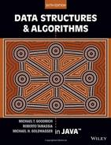

# CSC 2103 - Data Structures and Algorithms

**Lecturer**: Muthukumaran Maruthappa

**Textbook used**:
Data Structures and Algorithms in Java, 6th Edition by Tamassia, Goodrich. Wiley & Sons

[Back to Home](index.md)

---

## Contents

- [CSC 2103 - Data Structures and Algorithms](#csc-2103---data-structures-and-algorithms)
  - [Contents](#contents)
  - [Revision Questions](#revision-questions)
    - [Example Paper 1](#example-paper-1)
      - [Question 1](#question-1)
      - [Question 2](#question-2)
      - [Question 3](#question-3)
  - [Exam Coverage](#exam-coverage)

---

## Revision Questions

### Example Paper 1

#### Question 1

1. Define the term algorithm and list the properties of algorithms.
2. Write a pseudo code that finds the biggest element of an array.
3. Demonstrate the actions of Shell Sort for the list of numbers given: `6, 56, 34, 23, 16, 4, 8, 1, 30, 41, 37, 52, 2`

#### Question 2

1. Describe briefly a method (algorithm) that makes use of stacks to construct __postfix__ expressions from a given __infix__ expression.
2. Construct a binary search tree to store the following list of alphabets. Draw the binary search tree that you have constructed. A final binary search tree is acceptable. `B E A U T I F U L`
3. Construct an AVL tree from the following sequence `42  8 27  36  40`. Show the important working steps.

#### Question 3

1.

[Back to contents](#contents)

---

## Exam Coverage

- Lecture 1 - Intro to algorithms and data structure with example
- Lecture 2 - Sorting Algorithms
- Lecture 3 - Data Structures - Stack, Queue, List, ArrayList
- Lecture 4 - Tree, Tree Traversals, Binary Tree, AVL
- Lecture 5 - Red Black Trees, M-Way Tree, 2-4 Tree
- Lecture 7 - Hashing, open addressing, separate chaining
- Lecture 8,9 - Greedy Algorithm, Dijkstra, Krusal, Prim's Algorithm, Knapsack problem
- Lecture 10 - Back Tracking (8-Queen), Branch and Bound Algorithms (Assignment problem)
- Lecture 11 - String Processing - Boyer-Moore, KMP
- Lecture 12 - Heap Sort
- Lecture 13 - Huffman Coding
- Lecture 14 - Divide and Conquer Algorithms, Towers of Honoi

Grouping

1. 1, 2, 3
2. 4, 5
3. 8,9
4. 7,12
5. 11, 13

---

[Back to contents](#contents)

[Back to Home](index.md)
