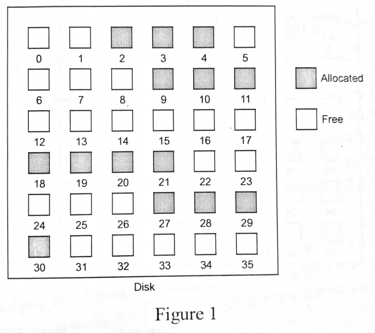
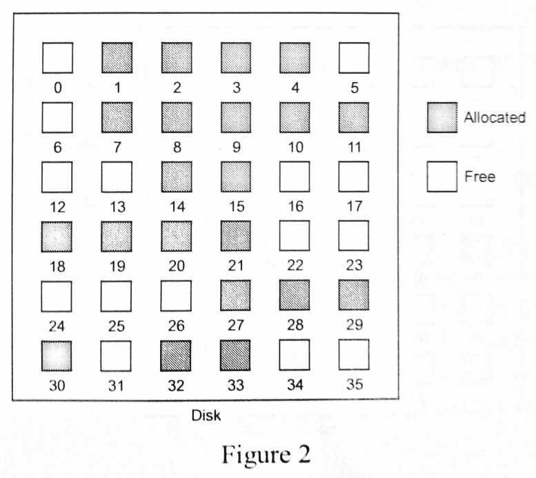

# CSC 2104 - Operating System Fundamentals

**Lecturer**: Dr Chia Wai Chong

**Textbook used**: Operating System Concepts, 9th Edition by Gagne, Galvin, Silberschatz. Wiley & Sons


[Back to Home](index.md)

## Contents

- [CSC 2104 - Operating System Fundamentals](#csc-2104---operating-system-fundamentals)
    - [Contents](#contents)
    - [Tutorial Notes](#tutorial-notes)
        - [Tutorial 1](#tutorial-1)
        - [Tutorial 2](#tutorial-2)
        - [Tutorial 3](#tutorial-3)
        - [Tutorial 4](#tutorial-4)
            - [A. Threading](#a-threading)
            - [B. Deadlock](#b-deadlock)
            - [C. Memory Management](#c-memory-management)
        - [Tutorial 5](#tutorial-5)
        - [Tutorial 6](#tutorial-6)

---

## Tutorial Notes

---

### Tutorial 1

1. Why is main memory not suitable for permanent storage or backup purposes? Furthermore, what is the main disadvantage to store information on a magnetic disk drive as opposed to main memory?

2. Identify **TWO** advantages and **TWO** disadvantages of open-source operating systems (eg. Linux).

3. Explain why an operating system can be viewed as a resource allocator.

4. What are the **TWO** fundamental approaches for users to interface with the operating system? Discuss, from your point-of-view, which approach is better.

5. Describe the CPU's two modes of operation (user mode and kernel mode).

6. What are the main factors that a programmer would take into consideration when designing an operating system for a smart TV?

7. There are **TWO** different ways that commands can be processed by a command-;ine interpreter. One way is to allow the command interpreter to contain the code needed to execute the command. The other way is to implement the commands through system programs. Compare and contrast the two approaches.

---

### Tutorial 2

1. What is the advantage and disadvantage of the microkernel approach when compared to the monolithic approach?

    - Advantage:
        - A simpler kernel design and functionality typically results in a more reliable operating system (less bugs)
        - Smaller file size, faster loading time
    - Disadvantage:
        - Overhead associated with inter-process communication (frequent use of the messaging functions for the user process and the system service to interact with each other)
        - Larger file size, slower loading time

2. What is a dynamically loadable module?

    - Modules can be selected and added to the kernel during runtime
    - For example, a device driver is loaded into the kernel only when the device is connected to the computer system.
    - Linux Kernel Module:
        - Extend functionalities without having to recompile the kernel
            - Develop driver to support new hardware
        - Can be loaded or unloaded from the kernel during runtime.
        - Higher level of execution privilege.

3. Describe FOUR advantages of using a virtual machine?

    - Runs multiple operating systems concurrently  on the same machine
    - Host system is protected from the guest server
    - Rapid porting and testing of programs in different environments.
    - Server consolidation where different services can now run on the same machine
    - Provides a good platform for OS research

4. What is the difference between a Type 1 hypervisor and a Type 2 hypervisor?

5. Compare and contrast the TWO inter-process communication models?

    - Message-Passing Model:
        - Useful for exchanging smaller amounts of data, because no conflicts need to be avoided (don't have to worry about race condition)
        - Easier to implement for communication between different systems (can also be implemented for communication within a computer)

    - Shared-Memory Model:
        - Maximum speed and convenience of communcation
        - Can be done at memory transfer speed when it takes place within a computer

6. What is the main factor that must be taken into consideration when processes communicate using the shared-memory model?

    - Synchronization
        - Ensure that two processes are not allowed to modify data stored in a memory location at the same time (to avoid data inconsistency)
        - A process should retrieve data stored in a memory location after the data is updated by another process


7. If a synchronous type of communication is required, what is the requirement that should be imposed on the sender and the receiver in the message-passing model?

    - Blocking send and blocking receive
    - The sender is blocked until the message is received by the receiving process or by the mailbox and the receiver is blocked until a message is available

8. What is the main difference between multi-programming and time-sharing in terms of execution?

    - Multiprogramming : The CPU will switch to execute another process __when the current process has to enter the waiting state__
    - Time-sharing : The CPU will switch to execute another process __when the time slice has expired (each process is only allocated within a specific time slice for execution)__

9. Is it possible to implement both multi-programming and time-sharing techniques into an operating system and having them running simultaneously? If YES, explain how it could be done. If NO, explain why it is not possible and justify your answer.

    - Yes, multi-programming can be applied to background processes whereas time-sharing for foreground processes

10. Describe the characteristics of short-term scheduler, medium-term scheduler, and long-term scheduler.

    - Short-Term Scheduler
        - Select which process to be executed by the CPU
        - Must select a new processs for the CPU frequently
    - Medium-Term Scheduler
        - Select which process to be brought into the ready queue
        - Execute less frequently than the short-term scheduler
    - Long-Term Scheduler
        - Determine which process to be swapped-out from / swapped into the memory
        - Swap out inactive process to create space for new processes

---

### Tutorial 3

**Question 1**

| Process | Arrival Time (ms) | Burst Time (ms) | Priority* |
| ------- | ----------------- | --------------- | --------- |
| P1      | 0                 | 15              | 5         |
| P2      | 3                 | 2               | 1         |
| P3      | 4                 | 6               | 3         |
| P4      | 8                 | 2               | 4         |
| P5      | 12                | 10              | 2         |

`*Note: Smaller number, higher priority`

1. Draw four Gantt charts that illustrate the execution of these processes using the FCFS, SJF, Preemptive Priority, and RR (quantum = 2 ms) scheduling algorithms.

    

2. Determine the **turnaround time** of each process for each of the scheduling algorithms in part (a). Also, calculate the **average turnaround time**.

3. Determine the **waiting time** of each process for each of the scheduling algorithms in part (a). Also, calculate the **average waiting time**.

    

**Question 2**

| Process | Arrival Time (ms) | Burst Time (ms) | Priority* |
| ------- | ----------------- | --------------- | --------- |
| P1      | 0                 | 6               | 2         |
| P2      | 3                 | 5               | 1         |
| P3      | 4                 | 2               | 3         |
| P4      | 8                 | 4               | 5         |
| P5      | 12                | 9               | 4         |

`*Note: Smaller number, higher priority`

1. Draw four Gantt charts that illustrate the execution of these processes using the FCFS, SJF, Preemptive Priority, and RR (quantum = 2 ms) scheduling algorithms.

    

2. Determine the **turnaround time** of each process for each of the scheduling algorithms in part (a). Also, calculate the **average turnaround time**.

3. Determine the **waiting time** of each process for each of the scheduling algorithms in part (a). Also, calculate the **average waiting time**.

    

**Question 3**

| Process | Arrival Time (ms) | Burst Time (ms) | Priority* |
| ------- | ----------------- | --------------- | --------- |
| P1      | 0                 | 2               | 4         |
| P2      | 1                 | 1               | 2         |
| P3      | 3                 | 7               | 5         |
| P4      | 8                 | 2               | 1         |
| P5      | 10                | 3               | 3         |

`*Note: Smaller number, higher priority`

1. Draw four Gantt charts that illustrate the execution of these processes using the FCFS, SJF, Preemptive Priority, and RR (quantum = 2 ms) scheduling algorithms.

    

2. Determine the **turnaround time** of each process for each of the scheduling algorithms in part (a). Also, calculate the **average turnaround time**.

3. Determine the **waiting time** of each process for each of the scheduling algorithms in part (a). Also, calculate the **average waiting time**.

    

---

### Tutorial 4

#### A. Threading

1. Describe the relationship between threads and processes.

    A process, which has its own memory space, is like a container for the threads. The threads share that memory space and they are the units of execution within the process. Each thread has its own set of registers, stack, and program counter.

2. If an application or function needs to be implemented as a set of related units of execution, why is it more efficient to do so as a collection of threads rather than a collection of separate processes?

    - Takes less time to create new threads in an existing process than to create an brand new process.
    - Takes less time to switch between two threads within the same process (less information to save)
    - Threads sharing the same user address space allow communication to take place without intervention from the kernel.

#### B. Deadlock

1. Describe the **FOUR** conditions that must hold simultaneously for a deadlock to occur.

    - **Mutual Exclusion** - a resource can be accessed by only one process at a time.
    - **Hold and Wait** - a process is holding at least one resource and is waiting to acquire additional resources that are currently being held by other processes.
    - **No Preemption** - resources cannot be preempted. The resources can only be released voluntarily by the process that is currently holding it.
    - **Circular wait** - two or more processes form a circular waiting chain, where each process waits for a resource at the next process in the chain holds.

2. What is the difference between deadlock prevention and deadlock avoidance.

    - Deadlock prevention is to ensure that at least one of the four conditions required to form a deadlock can never happen. It does not dynamically examine the resource allocation and make use of additional information to avoid allocation that might eventually lead to deadlock.

3. Given a set of active processes (P), a set of resources in a computer system (R), and a set of edges (E):

    `P = {P1, P2, P3}`

    `R = {R1, R2, R3, 2 x R4}`

    `E = {P1->R1,R4->P1,R3->P3,P3->R2,R2->P2,P2->R3,P3->R4}`

    If a resource can only be accessed by one process at a time, and a resource cannot be preempted, explain whether the computer system is in the deadlock state. You may assume that a process is in the running state if it is not requesting nor waiting for other resources.

#### C. Memory Management

1. Given **FIVE** memory partitions of 200 KB, 400 KB, 100 KB, 300 KB, and 700 KB (in order). How would each of the first-fit, next-fit, best-fit, and worst-fit algorithms place processes of 256 KB, 117 KB, 412 KB, and 226 KB (in order)?

    | Partition \ Fit | First-Fit     | Next-Fit      | Best-Fit      | Worst-Fit     |
    | --------------- | ------------- | ------------- | ------------- | ------------- |
    | 256 KB          | 400KB (114KB) | 400KB (144KB) | 300KB (44KB)  | 700KB (444KB) |
    | 117 KB          | 200KB (83KB)  | 144KB (27KB)  | 200KB (83KB)  | 444KB (327KB) |
    | 412 KB          | 700KB (288KB) | 700KB (288KB) | 700KB (288KB) | Wait          |
    | 226 KB          | 300KB (74KB)  | 288KB (62KB)  | 288KB (62KB)  | 400KB (174KB) |

2. Given **FIVE** memory partitions of 600 KB, 400 KB, 300 KB, 200 KB, and 100 KB (in order). How would each of the first-fit, next-fit, best-fit, and worst-fit algorithms place processes of 100 KB, 438 KB, 202 KB, and 337 KB (in order)?

    | Partition \ Fit | First-Fit     | Next-Fit      | Best-Fit      | Worst-Fit     |
    | --------------- | ------------- | ------------- | ------------- | ------------- |
    | 100 KB          | 600KB (500KB) | 600KB (500KB) | 100KB (0KB)   | 600KB (500KB) |
    | 438 KB          | 500KB (62KB)  | 500KB (62KB)  | 600KB (162KB) | 500KB (62KB)  |
    | 202 KB          | 400KB (198KB) | 400KB (198KB) | 300KB (98KB)  | 400KB (198KB) |
    | 337 KB          | Wait          | Wait          | 400KB (63KB)  | Wait          |

---

### Tutorial 5

1. Suggest a way to reduce external fragmentation and briefly explain the drawback of your suggestion.

    Dynamic partitioning can reduce external fragmentation, but the drawbacks would be that it is time consuming. Dynamic partitioning has 4 searching and placement algorithms that can be considered when processes are shifted - first fit, next fit, best fit, worst fit.

2. What is paging and why is is better than dynamic partitioning?

    Paging is when processes are moved to the secondary storage device instead of keeping it in the primary temporary storage. No external fragmentation when paging is used.

3. Describe page fault and explain how it will be handled.

    Page faults are when a running program tries to access a memory page that is not currently mapped by the memory management unit (MMU) into the virtual address space of a process. The steps the operating system takes to fix a page fault are:

    1. Check the location of the reference page in the page map table (PMT)
    2. If a page fault occured, call on the operating system to fix it.
    3. Using the frame replacement algorithm, find the frame location.
    4. Read the data from disk to memory.
    5. Update the page map table for the process.
    6. The instruction that caused the page fault is restarted when the process resumes execution.

4. Describe the relationship between demand paging and page fault.

    Demand paging is a type of virtual memory management, where the OS only copies a disk page when a process makes an attempt to access it. Page fault will result in demand paging, as the OS is unable to find the page, therefore causing demand paging to occur (searching for the page only when attempts to access it occurs).

5. Instead of using demand paging, do you think it is a good idea to preload/prefetch the pages of a process into the main memory before they are accessed? Justify your answer.

    Yes, it is a good idea because modern computers often have large amounts of RAM, and thus will most likely have enough free RAM to store preloaded and prefetched pages. This can help save time and also make the computer faster, as the RAM is much faster than secondary storage.

6. What are the advantages and disadvantages of using a smaller page size when compared to a larger page size?

    Advantages:
    - Less wasted space
    - The smaller the page size, the lesser is the amount of internal fragmentation

    Disadvantages:
    - The smaller the page, the greater is the number of pages required per process which could mean that some portion of page tables of active processes must be in virtual memory, not in main memory. This eventually leads to double page fault for a single reference of memory.

7. Consider a process 4GB virtual and physical address space. If the page size in such a system is 4KB, calculate the amount of physical memory space that is required to store the page table of the process. You can assume that 4B of memory is required to store an entry in the page table.

8. What is a translation lookaside buffer (TLB) ?

    A translation lookaside buffer (TLB) is a memory cache that is used to reduce the time taken to access a user memory location. It is a part of the chip's memory-management unit (MMU). The TLB stores the recent translations of virtual memory to physical memory and can be called an address-translation cache.

9. A system using dynamic partitioning has five empty memory partitions of 300KB, 200KB, 500KB, 250KB, and 700KB (in order). Determine how would each of the first-fit, next-fit, best-fit, and worst-fit algorithms place processes of 128KB, 100KB, 398KB, and 493KB (in order)?

---

### Tutorial 6

**Question 1**



Based on the distribution shown in Figure 1, answer the following questions

1. If bitmap is used to manage the free space, illustrate how the free-space list wouldlook like.
```text
001110
000111
000000
111100
000111
100000
```

2. Assuming that contiguous allocation is adopted, determine the location where the following files can be allocated using first-fit and worst-fit algorithms respectively.

- File A with the size of 2 blocks
- File B with the size of 3 blocks
- File C with the size of 6 blocks

| Fit\File  | File A | File B | File C |
| --------- | ------ | ------ | ------ |
| First fit | 0-1    | 5-7    | 12-17  |
| Worst fit | 12 -13 | 31-35  | x      |

1. If a file system could allocate 4KB of disk space as a single 4KB block, determine the number of blocks that is required to store a file with the size of 29KB

- 29/4 = 7.25 => 8 blocks

4. If the file system allows disk space to be allocated at different levels of granularity, for instance, the file system could allocate 8KB of disk space as a single 8KB block, or as eight 1KB sub-blocks. How would a file size of 29KB be stored in this case?

- 8

5. Do you think the feature in Question 1(d) could improve the performance? Explain your answer.

- Yes, this feature could help to reduce internal fragmentation. Without this feature, the file will have to occupy four 8KB blocks, and only 5KB is used in the last block. In this case, 3KB of free space is wasted. This feature allows the remaining free space to be allocated to another file.

6. Describe how bitmap can be used to manage the free space when the feature in Question 1(d) is implemented.

- Two-level bitmap

7. Compare bitmap and linked-list

- Bitmap - Memory/storage usage is proportional to the size of the hard disk.
- Linked-list - Occupy less storage space when the disk is almost full.

**Question 2**



Based on the distribution showed in Figure 2, answer the following questions.

1. Suggest **TWO (2)** allocation methods that can successfully allocate a file with the size of 8 blocks. Justify your answer.

- Linked allocation and indexed allocation
- Not necessary to allocate the contiguous blocks to a file when these two methods are adopted. The blocks associated with the same file can be scattered in different locations.

2. If a file system could allocate 8KB of disk space as a single 8KB block, determine the number of blocks that is required to store a file with the size of 50KB, by using **TWO (2)** allocation methods suggested in **part (a)** respectively. State clearly any **assumption(s)** that you have made.

- Linked allocation - If 1KB is required to store the reference (pointer) to another block, the remaining free space that can be allocated for data storage is 7KB. Hence, a file with the size of 50KB will have to occupy eight 8KB blocks.
- Indexed allocation -

3. Sketch **TWO diagrams** to show the allocation of blocks, based on the **TWO (2)** allocation methods suggested in **part (a)** and **part (b)**. Also indicate how the directory would have stored the entry for the file in each allocation method.

- Linked list

4. Give an example where using a larger allocation size (cluster size) could be better.

- When the disk or partition is used to store large files (eg videos, uncompressed pictures, etc)

---
