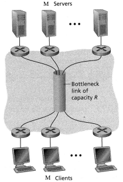

# NET2201 Computer Networks

- [NET2201 Computer Networks](#net2201-computer-networks)
  - [Tutorial 1](#tutorial-1)
  - [Tutorial 2](#tutorial-2)

## Tutorial 1

1. Compare and contrast packet switching and circuit switching.

   | Packet switching                                                                                     | Circuit switching                                                                                         |
   | ---------------------------------------------------------------------------------------------------- | --------------------------------------------------------------------------------------------------------- |
   | Higher performance efficiency (no reservation - more sharing of link capacity)                       | Lower performance efficiency (requires reservation, reserved resources may be underutilized or not enough |
   | Packets need to wait at queue (unpredictable and variable delay; not suitable for real-time service) | Packets don't need to wait at queue (reserved resources guarantee constant rate)                          |
   | Lower complexity                                                                                     | High complexity (reserved resources require end-to-end signalling protocol)                               |
   | Higher cost efficiency (no resources wasted on reservation)                                          | Lower cost efficiency                                                                                     |
   | **Example:** Internet                                                                                | **Example:** Telephone Networks                                                                           |

2. Do you agree that a traffic intensity of greater than 0.8 indicates congestion? Explain your answer.
	> Yes, a traffic intensity greater than 0.8 indicates congestion because traffic intensity to congestion ratio is exponential. The closer it gets to 1, congestion increases exponentially. At 1, congestion is infinite.

3. This elementary problem begins to explore propagation delay and transmission delay, two central concepts in data networking. Consider two hosts, A and B, connected by a single link of rate R bps. Suppose that the two hosts are separated by m meters, and suppose the propagation speed along the link is s meters/sec. Host A is to send a packet of size L bits to Host B.
	1. Express the propagation delay, dprop, in terms of m and s
		> d(prop) = m/s seconds
    > Propagation delay = d/s (d = distance, s = distance between routers)
	2. Determine the transmission time of the packet, dtrans, in terms of L and R.
		> d(trans) = L/R seconds
  3. Ignoring processing and queuing delays, obtain an expression for the end-to end delay.
		> d(end2end) = d(prop) + d(trans) ( (m/s) + (L/R) ) seconds
	4. Suppose Host A begins to transmit the packet at time `t = 0`. At time `t = d(trans)`, where is the last bit of the packet?
		> The bit is just leaving Host A.
	5. Suppose `d(prop)` is greater than `d(trans)`. At time `t = d(trans)`, where is the first bit of the packet?
		> The first bit is in the link and has not reached Host B.
	6. Suppose `s = 2.5 × 10^8`, `L = 120 bits`, and `R = 56 kbps`. Find the distance `m` so that `d(prop)` equals `d(trans)`.
		> m = (L/R)s = ( (1024/(256x10^3)) x (2x10^9) = 8000km

4. Consider the following scenario:

    

    Suppose that there are *M* client-server pairs. Denote `R(S)`, `R(C)` and `R` for the rates of the server links, client links, and network link. Assume all other links have abundant capacity and that there is no other traffic in the network besides the traffic generated by the *M* client-server pairs. Derive general expression for throughput in terms of `R(S)`, `R(C)` and `R` and `M`

  > F/Min R >> Rs, R >> Rf

5. Suppose two hosts, *A* and *B*, are separated by 20,000 kilometers and are connected by a direct link of `R = 2 Mbps`. Suppose, the propagation speed over the link is 2.5 × 10^8 meters/sec.
	1. Calculate the bandwidth-delay product, R x dprop
		> 0.016 - because d is in km while s is in m/s
	2. What does the bandwidth-delay product indicates?
		> The maximum number of bits that can exist in a network
	3. Consider sending a file of 800,000 bits from host A to host What is the maximum number of bits that will be in the link at any given time?
		> 0.016 Mbps

6. Referring to Question 6, but now with a link of R = 1 Gbps.
	1. Calculate the bandwidth-delay product, R x dprop
		> 8 Mbps
	2. Consider sending a file of 800,000 bits from host A to host What is the maximum number of bits that will be in the link at any given time?
		> 8 Mbps

## Tutorial 2

1. Explain the differences between client-server architecture and peer-to-peer architecture.

   | Peer-to-peer networks                                                                | Client-server                                                               |
   | ------------------------------------------------------------------------------------ | --------------------------------------------------------------------------- |
   | - Clients and servers are not distinguished as each node acts as a client and server | - Specific server and specific clients                                      |
   | - Each node can request for services and can provide services                        | - Client requests for the service and the server responds with the service. |
   | - Focuses on connectivity                                                            | - Focuses on information sharing between client and server                  |
   | - Each peer has it's own data                                                        | - Data is stored in a centralized server                                    |
   | - Cannot get bottlenecked                                                            | - Bottlenecking can occur                                                   |
   | - Less expensive to implement                                                        | - Client-server architecture is more expensive to implement                 |
   | - Unstable because it relies on the number of peers                                  | - More stable because it uses dedicated servers                             |

2. What are the two types of HTTP connections? Compare and contrast them.

   | Non-persistent HTTP Connection                                      | Persistent HTTP Connection                                    |
   | ------------------------------------------------------------------- | ------------------------------------------------------------- |
   | - Send at most one object over a single TCP connection, then closes | - Sends multiple objects over a TCP connection before closing |
   | - Require multiple connections to download multiple objects         | - Requires a single connection to download multiple objects   |

3. Explain the following characteristics of HyperText Transfer Protocol (HTTP)?
	1. Connection-oriented
	> Requires a new connection for each request and does not maintain a single connection during client-server communication.
	2. Stateless
   > The server has no record or knowledge of the past requests from the clients.

4. Why is a centralized DNS server impractical?
  - Has a single point of failure
  - High traffic volume
  - Can cause high delay if DNS server is far from client
  - High maintenance

5. Do you agree that recursive query is more efficient than iterated recursive query? Justify your answer.
   > A recursive query can handle a heavier load than a recursive iterated query

6. Consider the following scenario, for which there is an institutional network connected to the Internet and assume that the access link is of `15 Mbps`. Suppose that the average object size is `850,000 bits` and that the average request rate from the institution’s browsers to the origin servers is *16 requests per second*. Also suppose that the amount of time it takes from when the router on the Internet side of the access link forwards an HTTP request until it receives the response is *3 seconds* on average. Model the total average response time as the sum of the average access delay (that is, the delay from Internet router to institution router) and the average Internet delay. For the average access delay, use `Δ / (1 ‒ Δ∙β)`, where `Δ` is the average time required to send an object over the access link and `β` is the arrival rate of objects to the access link.
	1. Find the total average response time.
   > answer
	2. Now suppose a cache is installed in the institutional LAN. Suppose the miss rate is 0.4. Find the total response time.
   > answer

   access link = 15 Mbps
avg object size = 850k bits
avg request time = 16 r/ps

7. Consider distributing a file of `F = 15 Gbits` to `N` peers. The server has an upload rate of `u(s) = 30 Mbps`, and each peer has a download rate of `d(i) = 2 Mbps` and an upload rate of `u`. For `N = 10`, `100`, and `1,000` and `u = 300 Kbps`, `700 Kbps`, and `2 Mbps`, prepare a chart giving the minimum distribution time for each of the combinations of `N` and `u` for both client-server distribution and P2P distribution.

---

[Back to Home](index.md)
